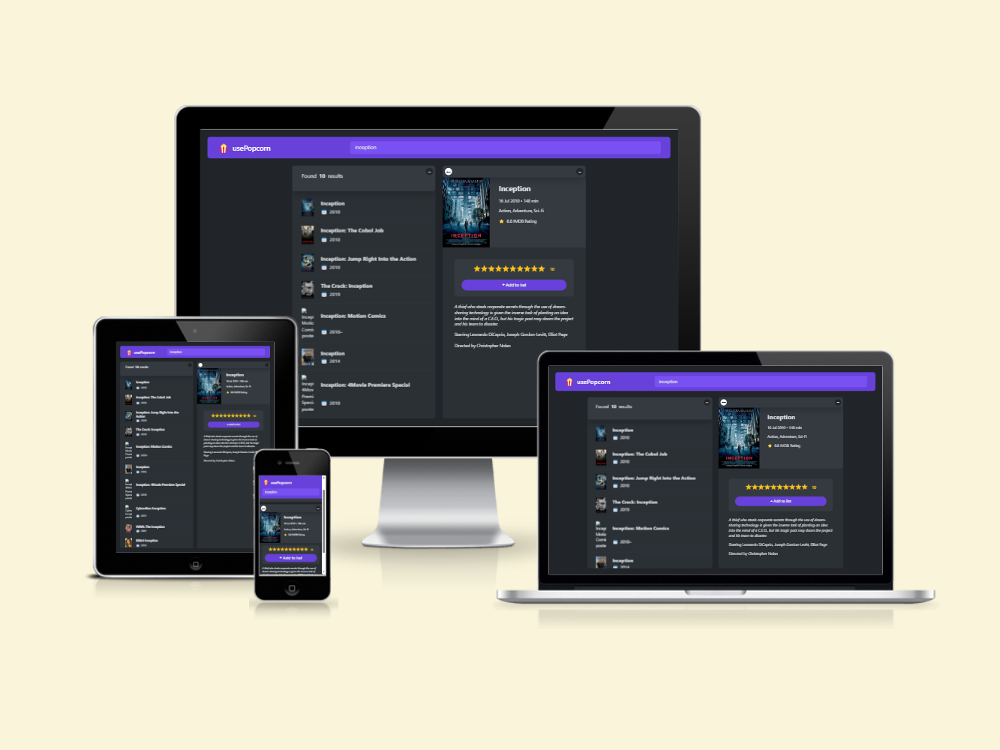

# usePopcorn - A React app to search for movies, view movie details, and rate and add movies to your watchlist

This project is a part of [The Ultimate React Course 2023: React, Redux & More](https://www.udemy.com/course/the-ultimate-react-course/) by [Jonas Schmedtmann](https://github.com/jonasschmedtmann). The website's design and structure were provided as part of the course curriculum, and I did not design the website from scratch. The primary purpose of this project is to practice and apply the concepts learned during the course.

## Live Demo

Check out the live demo of the project [here](https://usepopcorn-krittin-saenpakdi.netlify.app/).

## Description

usePopcorn is a web application that utilizes React concepts including `useEffect`, data fetching, and custom hooks to fetch data from the [OMDb API](https://www.omdbapi.com/), a comprehensive database of movie information. It allows users to:

- Search for movies
- View movie details
- Rate and add movies to their watchlist

usePopcorn is a great way to learn and practice React concepts and explore the OMDb API. It's also a useful tool for managing your movie watchlist.

**Benefits of using usePopcorn:**

- Easy to use and navigate.
- Responsive and looks good on all devices.
- Built using React, a popular JavaScript library.
- Utilizes React concepts such as `useEffect`, data fetching, and custom hooks.
- Great for learning and practicing React concepts.
- Useful for managing your movie watchlist.

## Features

- **Search movies by title:** Users can enter a movie title in the search box and press enter to see results.
- **Focused search box:** The search box is automatically focused when the page loads.
- **Clear search query:** Users can press enter to clear the search query after input.
- **Preview search results:** Display movie titles and release years; users can click on a movie to view more details.
- **Detailed search results:** Includes title, poster, runtime, IMDb rating, plot, release year, actors, director, and genre.
- **Automatic page title update:** Page title is automatically updated to the selected movie title.
- **Rate and add movies to watchlist:** Users can rate movies (1 to 10) and add them to their watchlist.
- **Return to watchlist from search results:** Users can press the escape key to return from the search results detail page to the watchlist.
- **Persisted watchlist:** The watchlist is automatically persisted in local storage.
- **Remove movies from watchlist:** Users can remove movies from their watchlist by clicking the "X" button next to the movie.
- **Responsive design:** The app is responsive and looks good on all devices.

## Screenshots



## Getting Started

To get started with usePopcorn, you will need to have Node.js and Vite installed on your machine.

To install Node.js, visit the Node.js website: https://nodejs.org/en.

To install Vite, run the following command in your terminal:

```
npm install -g vite
```

Once you have Node.js and Vite installed, you can clone the usePopcorn repository to your local machine:

```
git clone https://github.com/SuperUser-Gump/usePopcorn.git
```

Navigate to the usePopcorn directory and install the dependencies:

```
cd usePopcorn
npm install
```

To start the development server, run the following command:

```
npm run dev
```

The development server will be running on http://localhost:5173. You can open this URL in your web browser to view the usePopcorn app.


## Usage

To use usePopcorn, simply navigate to the website and start searching for movies. You can search by title.

Once you find a movie that you are interested in, click on it to view the details page. The details page will show you the movie title, poster, runtime, IMDb rating, plot, release year, actors, director, and genre. You can also rate the movie and add it to your watchlist.

To remove a movie from your watchlist, simply click on the "X" button next to the movie.

## Acknowledgments

This project was created as part of [The Ultimate React Course 2023: React, Redux & More](https://www.udemy.com/course/the-ultimate-react-course/) by [Jonas Schmedtmann](https://github.com/jonasschmedtmann). Special thanks to him for providing the project structure and design.
